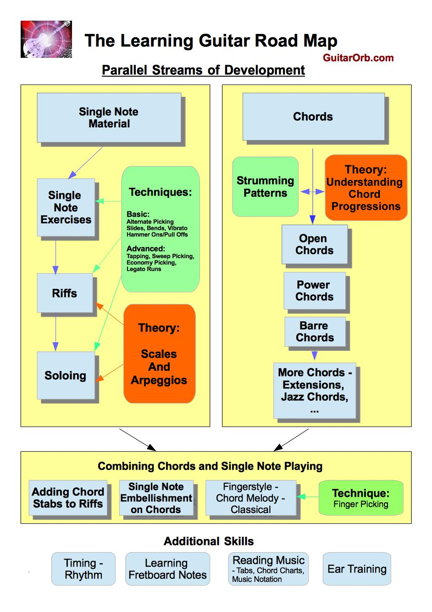

# Note
  This article copy from.For recording.
 - [The Learning Guitar Roadmap](http://www.guitarorb.com/learning-guitar-roadmap/)

# The Roadmap

If your starting out at guitar, I’d recommend to tackle two parallel streams of practice at the same time. One is your single note playing and the other is learning chords. Both of these streams should be supplemented by their own theory and techniques.

## Single Note Playing (爬格子练习)

In terms of single note playing, you will probably want to start with some simple exercises to build coordination and synchronise your right and left hands. I always recommend a student starts practicing the 1 – 2 – 3 – 4 exercise right from day one. In this exercise you ascend the fretboard playing one note with each of your four left hand fingers for each position:

Ascending：
    E|--1--2--3--4--2--3--4--5--3--4--5--6-          -8--9--10--11--9--10--11--12-
    B|-------------------------------------          -----------------------------
    G|-------------------------------------          -----------------------------
    D|-------------------------------------    ...   -----------------------------
    A|-------------------------------------          -----------------------------
    E|-------------------------------------          -----------------------------

Descending:
    E|--12--11--10--9--11--10--9--8--10--9--8--7-         -5--4--3--2--4--3--2--1-
    B|-------------------------------------------         ------------------------
    G|-------------------------------------------         ------------------------
    D|-------------------------------------------   ...   ------------------------
    A|-------------------------------------------         ------------------------
    E|-------------------------------------------         ------------------------
  
There are all sorts of variations of this exercise such as moving up and down the neck on one string or up and down all six strings per fret. The exercise can be practiced with all down strokes and is also useful to start developing alternate picking with.

Depending on the level of technique and speed you want to develop in your playing, tackling different form of single note exercises can continue quite a way into your development. Even as your lead approaches quite advanced levels, you may continue with exercises for advanced techniques such as tapping or sweep picking.

## Single Note Riffs (乐句)

Before starting to look at soloing, very early in the learning process I would recommend beginners start to practice a range of single note riffs from songs they like. This could start right from day one with simplified version of things like *the blues brothers riff* or *smoke on the water*, and you can keep getting more complex till your playing riffs such as *the Sweet Child* of Mine intro, *the Michael Jackson “Beat IT”* riff, *The Beatles “Day Tripper”* and the list goes on. I think these sorts of riffs are a great way to start to take your single note technique further than exercises and are useful to start to develop a basic coordination before tackling soloing.

As you develop further you can get into writing your own riffs and start coming up with much more technically challenging material to work on here.

## Soloing

Once you’ve developed some reasonable co-ordination at single note playing you can move into soloing and learning to improvise. It’s at this point that a knowledge of scales can really start to pay off and form the basis of your progress. In my [guitar scales](http://www.guitarorb.com/guitar-scales/) article I recommend people start by learning **six of the most common guitar scales**. This would start with the most commonly used of all guitar scales, *the minor pentatonic scale*. The process of learning scales can quite naturally transition into learning to solo. As you practice the scales and it’s sequences to learn the pattern, you also start experimenting with the notes of the scale to come up with phrases that you like the sound of and learn existing licks. This then naturally moves into soloing as you start to apply this over backing tracks and become more spontaneous with the process to the point of improvisation.

## Single Note Technique

As you move through the steps above there’s a range of single note techniques to learn on the instrument that will add variety and color to your playing. These include techniques such as bends, vibrato, slides and hammer ons and pull offs.

# Learning Chords

At the same time as developing your single note playing you should also start to learn chords. There is a large range of chords you can integrate into your playing and you should learn broad categories of chords in order of difficulty.

## Open Chords

The first chords people learn are open chords. These are the most common type of chords, and the 8 most common open chords would be C, D, G, E, A, Em, Am and Dm. It will initially be a challenge to learn to finger each of these chords and transition between them smoothly while playing in time. You can learn about these open chords in our [open chord section](http://www.guitarorb.com/open-chords/).

## Power Chords

At the same time as learning open chords, or shortly after, power chords would be the next type of chord to learn. These chords only involve 2 or 3 strings and are moveable in that once you learn the shape of the chord, you can simply move it up or down the neck to change the chord. Power chords are common in styles with distorted electric guitar such as hard rock or heavy metal. Some examples of songs with power chords are Nirvana’s “Smells Like Teen Spirit” and “You Really Got Me” by the Kinks.

## Barre Chords

After getting a good grip on both open and power chords, you can start to tackle barre chords. Just like power chords, barre chords are moveable in that once you have learned a shape, you can change the chord by simply moving the shape up or down the neck, but unlike power chords you can play major, minor, dominant 7th and a range of other types of chords as barre chords. Power chords have a minimal set of notes and are therefore not major or minor in tonality but barre chords add the extra notes required to achieve this.

In learning barre chords, you will need to learn to bar you index finger across all the strings on a single fret and these chords will take quite a bit more practice to learn than open chords and power chords.

## More Chords

With the above chords under your belt, there a vast array of additional chords you can add to your skills such as 9th chords for blues, the Hendrix E7#9 chord, and a wide range of jazz chords as examples.

This is the sort of sequence of chords I would tackle in that order when learning the instrument, and at the same time as learning these chords some complementary skills to focus on are strumming patterns and some basic theory.

Learning a good range of strumming patterns and loosening up your right hand is a way to make virtually any chord progression come alive. You can also get quite rhythmic with your strumming patterns, all the way to almost viewing your strumming as a drum.

You should also complement this material with gaining a basic understanding of theory. Such theory includes an understanding of intervals and which intervals comprise the various chords as well as understanding how chords relate together in a chord progression. As a first step in understanding chord progressions, I would recommend looking at how to form chords from a scale that act as a family of chords in the one key. You can read about this in the article on forming chords from scales. You can also go into a lot more detail on understanding chord progressions by studying classical theory such as four part harmony or the common chord progressions that occur in many jazz standards. A good resource to learn these common jazz chord progressions is this jazz guitar chords guide.

# Combining Chords and Single Note Playing

With a good grip on both single note playing and chords, you can start to get into styles that combine both of these elements in a single guitar part. The first step here could be viewed as adding chords in among riffs or single note passages into chord progressions. These are very similar and I really just view the difference based on if there is more riff type single notes in the passage or if its more chordal based. To get a feel for the sort of thing I am referring to here, a great exponent of this sort of stuff was Jimi Hendrix. Songs like the rhythm part to Angel and Hey Joe blend chords and single note passages seamlessly into the one part.

As a culmination of combining chords and single notes you move into playing where the one guitar part can carry melody, chords and potentially bass all in the one part. This is achieved through finger picking styles such as fingerstyle guitar, classical guitar or the chord-melody playing of jazz musicians. Probably some of the most well known fingerstyle players include Chet Atkins, Tommy Emmanuel and Sangha Jung. I personally tend to view these sort of styles as almost the pinacle of the instrument, probably in part due to the fact that I like to play as a soloist rather than as a band member.

# Additional Skills (视唱练耳)

As well as the sequences of skills and theory presented above there are a number of other skills that should be developed concurrently to your playing.

## Rhythm/Timing

Your rhythm and timing is a skill that should keep developing as long as you play the instrument. In terms of timing the ability to place a note exactly on the beat or at an exact desired lag of the beat is a major skill for musicians. Timing is best developed by playing with a metronome or drum tracks. One of the key elements here is that when practicing with a metronome, you should be listening more to the metronome than your own playing.

## Fretboard Notes

Learning the notes of the fretboard is an area that is often neglected by guitarists and I have trouble thinking of any other instrument where a knowledge of the notes you are playing is not ingrained from a very early stage. You ultimately want to know what all the notes of the fretboard are on all strings, all the way up the neck, but as an initial step learning the notes of the bottom two strings will let you find the position of common barre chords and scale patterns very easily. Additionally, learning the notes of the open strings and first four frets opens up possibilities of learning basic classical guitar and fingerstyle songs very early in the piece as a lot of playing in these styles is in the open position. To help learn the fretboard notes I recommend taking a look at the guitar notes fretboard trainer I developed for this.

## Reading Music

There are three main types of reading music for guitar players. Probably the first and most common method is to read tabs where each line corresponds to a string and numbers correspond to fret numbers. Reading chord charts is also important and finally reading music notation is a very valuable skill. Guitar would be one of the harder instruments to learn to read music notation on as many notes can be played in several different positions of the neck on different strings which would be the reason many guitarists never properly learn to read music and rely more on tabs or using their ear. To help learn to read music you might like to take a look at our reading music game and reading music fretboard trainer.

## Ear Training

Finally, I believe ear training is of the utmost importance for all musicians. This can be developed through figuring songs out by ear from recordings or alternatively, your can find a number of ear training tools and apps where you practice recognising intervals, chord types, scales and chord progressions by ear.

A few final words here, This roadmap is simply one possible birds eye view of the overall process of learning guitar that I see as quite intuitive, but there would be many possible breakdowns of the process that could serve a similar purpose.

Additionally, not all of these skills are learned by all players. Consider BB King. He focused almost exclusively on Blues soloing in his playing and is still considered a legend of the instrument.

Another thing to be aware of is that it is often the case that practicing any of these skills will have the effect of improving all or many of the other skills at the same time. For example, its quite possible that if after some initial exposure to soloing, if you spend a period of time looking almost exclusively at more chords and chord progression, when you eventually come back to your soloing you could well have improved in that area shortly after returning to some lead practice.

