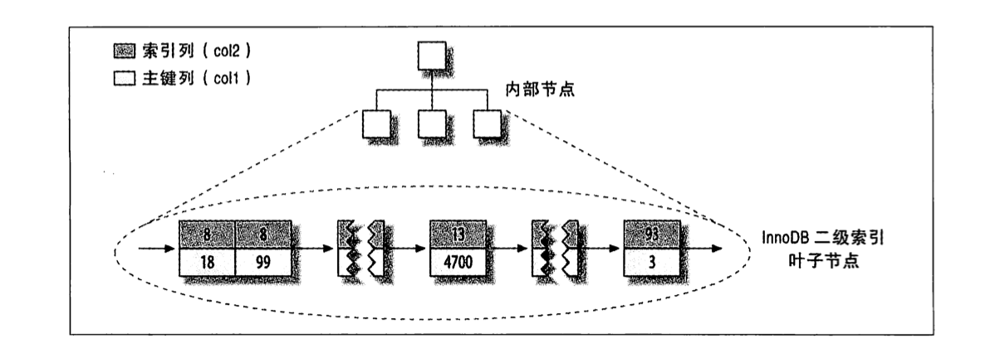

## 索引是什么

索引（在MySQL中也称为“*键（key）*”），用于存储引擎快速找到记录的一种数据结构。**这是索引的基础功能。** 索引可以包含一个列或多个列，当索引包含多个列的时候，那么列的顺序也十分重要，因为MySQL只能使用**最左前缀列**。

## 索引的目的

 - 索引大大减少了服务器扫描的数据量
 - 帮助服务器避免排序和临时表
 - 索引可以将随机I/O变为顺序I/O

## 索引的种类

在MySQL中，索引是由存储引擎实现的而不是由服务层实现的，所以并没有同一的标准：**不同存储引擎的索引工作方式并不一样**，也不是所有的存储引擎都支持所有类型的索引。即时多个存储引擎支持同种索引，其底层实现也可能不同。

#### B-Tree索引

B-Tree是为磁盘等外存储设备设计的一种平衡查找树。因此在讲B-Tree之前先了解下磁盘的相关知识。

系统从磁盘读取数据到内存时是以磁盘块（block）为基本单位的，位于同一个磁盘块中的数据会被一次性读取出来，而不是需要什么取什么。

InnoDB存储引擎中有 **页（Page）** 的概念，页是其磁盘管理的**最小单位**。InnoDB存储引擎中默认每个页的大小为16KB，可通过参数innodb_page_size将页的大小设置为4K、8K、16K，在MySQL中可通过如下命令查看页的大小：
> show variables like 'innodb_page_size';

而系统一个磁盘块的存储空间往往没有这么大，因此InnoDB每次申请磁盘空间时都会是若干地址连续磁盘块来达到页的大小16KB。InnoDB在把磁盘数据读入到磁盘时会以页为基本单位，在查询数据时如果一个页中的每条数据都能有助于定位数据记录的位置，这将会减少磁盘I/O次数，提高查询效率。

B-Tree结构的数据可以让系统高效的找到数据所在的磁盘块。为了描述B-Tree，首先定义一条记录为一个二元组[key, data] ，key为记录的键值，对应表中的主键值，data为一行记录中除主键外的数据。对于不同的记录，key值互不相同。

每个节点占用一个盘块的磁盘空间，一个节点上有两个升序排序的关键字和三个指向子树根节点的指针，指针存储的是子节点所在磁盘块的地址。两个关键词划分成的三个范围域对应三个指针指向的子树的数据的范围域。以根节点为例，关键字为17和35，P1指针指向的子树的数据范围为小于17，P2指针指向的子树的数据范围为17~35，P3指针指向的子树的数据范围为大于35。

### B+Tree索引

从B-Tree结构图中可以看到每个节点中不仅包含数据的key值，还有data值。*而每一个页的存储空间是有限的，如果data数据较大时将会导致每个节点（即一个页）能存储的key的数量很小，当存储的数据量很大时同样会导致B-Tree的深度较大，增大查询时的磁盘I/O次数，进而影响查询效率*。在B+Tree中，所有数据记录节点都是按照键值大小顺序存放在同一层的叶子节点上，而非叶子节点上只存储key值信息，这样可以大大加大每个节点存储的key值数量，**降低B+Tree的高度**。

由于B+Tree的非叶子节点只存储键值信息，假设每个磁盘块能存储4个键值及指针信息，则变成B+Tree后其结构如下图所示：

适用条件：
 - 全值匹配
 - 匹配最左前缀
 - 匹配范围值
 - 精确匹配某一列并范围匹配另一列
 - 值访问索引的查询

限制：
 - 如果不是按照索引的最左列开始查找，则无法使用索引
 - 不能跳过索引中的列
 - 如果查询中有某个列的范围查询，则其右边所有列都无法使用索引优化查找

### Hash索引

哈希索引（hash index）基于哈希表实现，只有精确匹配索引所有列的查询才有效，对于每一行数据，存储引擎都会对所有的索引列计算一个哈希值，哈希值是一个较小的值，并不同的键值的行计算的哈希值也不一样。哈希索引将所有的哈希值存储在索引中，同时在哈希表中保存指向每个数据行的指针。

限制：
 - 哈希索引只包含哈希值和行指针，不存储字段值，所以不能使用索引中的字段避免读取行
 - 哈希索引数据无法用于排序
 - 不支持索引列匹配查找，例如，在数据列（A，B）上建立的索引，如果查询只用到列A列则无法使用该索引
 - 哈希索引只支持等值比较查询
 - 哈希冲突太多会导致性能很低

InnoDB中有一个特殊的功能叫做“**自适应索引**”InnoDB会注意到使用非常频繁的索引值，会在内存中基于B-Tree索引之上再创建一个哈希索引。

## 如何正确的使用索引

### 独立的列

“*独立的列*”是指索引列不能是表达式的一部分，也不能是函数的参数。

例如：

> mysql> SELECT actor_id from actors where actor_id +1 =5 ;

这个例子就无法使用索引列 *actor_id* 。所以在使用WHERE条件的时候，始终将索引列单独放在比较符号的一侧，也不能对索引列使用函数。

### 前缀索引和索引选择性

由于需要索引列是一个很长的字符串，这样会导致索引边的慢且大。这时可以通过使用**前缀索引**来解决，这样可以大大节约索引空间，从而提高索引效率。但是这样会降低索引的*选择性*。
> 选择性=补充度的索引值(基数)/数据表的记录时总数(#T)

索引的选择性越高则查询效率越高，唯一索引的选择性是1，这时最好的索引选择性，性能也是最好的。

### 多列索引

在多个列上建立独立的单列索引大部分情况下并不能提高MySQL的查询性能。新版本的MySQL中引入了一种叫“*索引合并*”的策略

### 聚簇索引

聚族索引并不是一种单独的索引类型，而是一种数据存储方式。*InnoDB聚族索引实际上在同一个结构中保存了B-Tree索引和数据行*

聚簇索引就是按照每张表的主键构造一颗B+树，同时叶子节点中存放的就是整张表的行记录数据，也将聚集索引的叶子节点称为数据页。这个特性决定了索引组织表中数据也是索引的一部分，每张表只能拥有一个聚簇索引。 

聚簇索引的每一个叶节点都包含了*主键值*、 *事务ID*、 *用于事务和MVCC的回滚指针*、*以及剩余的列*

Innodb通过主键聚集数据，如果没有定义主键，innodb会选择非空的唯一索引代替。如果没有这样的索引，innodb会隐式的定义一个主键来作为聚簇索引。

聚簇索引的优缺点
- 优点：
  - 数据访问更快，因为聚簇索引将索引和数据保存在同一个B+树中，因此从聚簇索引中获取数据比非聚簇索引更快
  - 聚簇索引对于主键的排序查找和范围查找速度非常快
  - 使用 *覆盖索引* 扫描的查询可以直接使用页节点中的主键值
- 缺点：
  - 插入速度严重依赖于插入顺序，按照主键的顺序插入是最快的方式，否则将会出现页分裂，严重影响性能(例如：*使用UUID作为索引，它会使插入边的完全随机就会造成页分裂和产生随机碎片*)。因此，对于InnoDB表，我们一般都会定义一个自增的ID列为主键
  - 更新主键的代价很高，因为将会导致被更新的行移动。因此，对于InnoDB表，我们一般定义主键为不可更新。
  - 二级索引访问需要两次索引查找，第一次找到主键值，第二次根据主键值找到行数据。
  - 聚簇索引可能导致全表扫描变慢，尤其是行比较稀疏，或者由于 **页分裂** 导致数据存储不连续的时候

### 辅助索引（非聚簇索引）

在聚簇索引之上创建的索引称之为辅助索引，辅助索引访问数据总是需要二次查找。辅助索引叶子节点存储的不再是行的物理位置，而是主键值。通过辅助索引首先找到的是主键值，再通过主键值找到数据行的数据页，再通过数据页中的Page Directory找到数据行。

Innodb辅助索引的叶子节点并不包含行记录的全部数据，叶子节点除了包含键值外，还包含了相应行数据的聚簇索引键。这样的策略减少了当出现行移动或者数据页分裂时二级索引的维护工作。使用主键当作指针会让二级索引占用更多的空间，换来的好处是，InnoDB在移动行时无须更新二级索引中的这个“指针”

辅助索引的存在不影响数据在聚簇索引中的组织，所以一张表可以有多个辅助索引。在innodb中有时也称辅助索引为二级索引。

与MyISAM引擎中索引的区别如下图：

### 覆盖索引

如果一个索引包含（或者说是覆盖）所有需要查询的字段的值，我们就称之为“*覆盖索引*”，覆盖索引的优点本质上就一条：**覆盖索引能够避免 *回表***；

不是所有类型的索引都可以称为覆盖所有。覆盖所有必须要存储索引列的值，而哈希索引、空间索引和全文索引等都不存储索引列的值，所以MySQL只能使用B-Tree索引做覆盖索引。

当发起一个被索引覆盖的查询（也叫做索引覆盖查询）时，在EXPLAIN的Extra列可以看到“*Using index*”的信息

MySQL查询优化器会在执行查询前判断是否有一个索引能够进行覆盖 

## 参考

- [聚簇索引和非聚簇索引(通俗易懂 言简意赅)](https://www.cnblogs.com/jiawen010/p/11805241.html)
- [Mysql 索引](https://choucmei.github.io/sql-%E9%A2%84%E7%83%AD/)