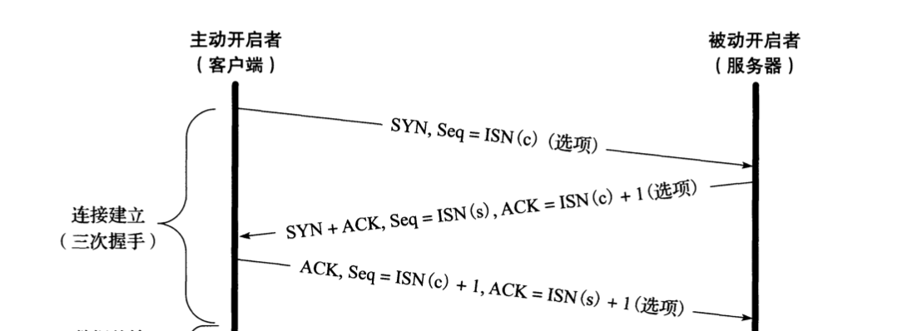
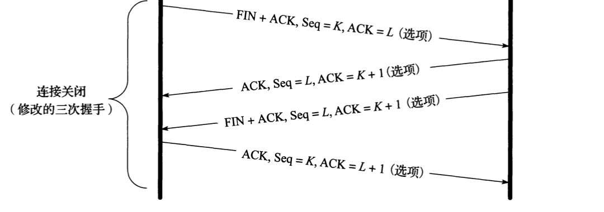

## TCP是什么 ?

传输控制协议（TCP）是互联网协议组中重要的组成部分之一。TCP的实现之初是为了补充互联网协议（IP）。因此，这一对组合经常被称为TCP/IP。TCP协议的特点：**可靠性**、**顺序性**、**错误检查**、**数据流传输**。大部分常见的应用都是使用的是TCP协议，例如：*World Wide Web*、*Email*、*文件传输*.TCP是面向连接的，这就需要客户端主动与服务端建立起连接之后才能开始传输数据。如果应用不需要可靠的数据流传输服务可能UPD协议是个更好的选择。

## 为什么需要TCP ?

TCP是个重要的协议是因为它在互联网的基础上建立了一套规则与标准化的信息数据传输机制。TCP让互联网之间的数据传输能够无视各种条件的限制（不管是地区限制、软件或硬件的限制），并且它是灵活的可拓展的（比如TCP/IP、增加SSL等），并且它是开源的不是私人所有。

## 如何保证传输的可靠性?

### TCP segment structure

TCP报文段分为两段：**报头**、**数据段**。*报头*包含10个字段和一个可选的拓展字段。*数据段*紧跟在 *报头*后面，里面装的都是应用传输的数据。数据的大小（length）不包括在 *报头*中；但是可以通过IP数据报的报头中指定的长度减去TCP报头的长度就得到了数据段的大小了。

#### 源端口(16 bits) & 目的端口(16 bits)

本机端口和目的地端口

#### 序列号(32 bits)

序列号就是用来标记每一个请求的，相当于请求的ID。
- 如果含有同步标识（SYN），则此为最初的序列号；第一个数据比特的序列码为本序列号加一
- 如果没有同步标识（SYN），则此为第一个数据比特的序列码

#### 确认号 (32 bits)

ACK如果被启用了，那么表示收到信息，并且ACK=（发送者的序列号+1）用于验证。

#### 连接建立

TCP连接的建立需要进行**三次握手**。在客户端尝试连接服务端之前，服务端需要绑定一个端口并监听它（passive open），之后客户端会主动向服务端发送建立连接请求，并进行 *三次握手* 建立连接。

1.客户端向服务端发起一个 **SYN**请求，并将生成一个随机的序列号A。

2.作为响应，服务端回复带有SYN-ACK标示的应答。其中ACK=A+1，并同时生成一个随机序列号B。

3.最后，客户端收到服务端的ACK应答之后。客户端又会给服务端一个ACK应答并且序列号也会加一也A+1，然后ACK的序列号也加一B+1

到这时候，客户端和服务端都收到了确认连接的消息。步骤1、2建立一个方向的连接参数(序列号)并确认。步骤2、3建立另一个方向的连接参数(序列号)并确认。有了这些，就可以建立全双工通信。

TCP 连接使用三次握手的首要原因：为了 阻止历史的重复连接初始化造成的混乱问题。如果通信双方的通信次数只有两次，那么发送方一旦发出建立连接的请求之后它就没有办法撤回这一次请求，如果在网络状况复杂或者较差的网络中，发送方连续发送多次建立连接的请求，如果 TCP 建立连接只能通信两次，那么接收方只能选择接受或者拒绝发送方发起的请求，它并不清楚这一次请求是不是由于网络拥堵而早早过期的连接。

所以，TCP 选择使用三次握手来建立连接并在连接引入了 RST 这一控制消息，接收方当收到请求时会将发送方发来的 SEQ+1 发送给对方，这时由发送方来判断当前连接是否是历史连接：

如果当前连接是历史连接，即 SEQ 过期或者超时，那么发送方就会直接发送 RST 控制消息中止这一次连接；
如果当前连接不是历史连接，那么发送方就会发送 ACK 控制消息，通信双方就会成功建立连接；
使用三次握手和 RST 控制消息将是否建立连接的最终控制权交给了发送方，因为只有发送方有足够的上下文来判断当前连接是否是错误的或者过期的，这也是 TCP 使用三次握手建立连接的最主要原因。

#### 连接终止

TCP连接的关闭需要进行 **四次挥手**，两边都需要关闭连接，整个TCP连接才算完整的关闭。希望关闭连接，就会传送 **FIN** 包并包含之前的ACK包。所以关闭连接需要 一组 **FIN** 和 **ACK**。当一边的发送了第一个 **FIN**和最后的 **ACK**，会进入一个等待超时状态 **TIME_WATI** 之道整个连接关闭，在整个连接关闭之前TCP占用的端口不能被其他新连接所使用；这防止了由于延迟发包带来的混乱问题。

对于复杂的网络状态，TCP 的实现提出了多种应对措施， TIME_WAIT 状态的提出就是为了应对其中一种异常状况。在 TIME_WAIT 阶段，主动端等待 2*MSL（最大分段寿命：表示一个 TCP 分段可以存在于互联网系统中的最大时间，由 TCP 的实现，超出这个寿命的分片都会被丢弃） 时间， MSL 建议为 2 分钟。

如果没有 TIME_WAIT 状态，Client 不再保存这个连接的信息，收到一个不存在的连接的包，Client 会响应 RST 包，导致 Server 端异常响应。此时， TIME_WAIT 是为了 保证全双工的 TCP 连接正常终止。

如果双方挥手之后，一个 网络四元组（src/dst ip/port）被回收，而此时网络中还有一个迟到的数据包没有被 Server 接收，Client 应用程序又立刻使用了同样的四元组再创建了一个新的连接后，这个迟到的数据包才到达 Server，那么这个数据包就会让 Server 以为是 Client 刚发过来的。此时， TIME_WAIT 的存在是为了 保证网络中迷失的数据包正常过期。

连接可以处于**半开**状态，意思就是TCP的有一方连接已经关闭了，另一方还没有关闭。

### 数据传输

#### 可靠性传输

TCP使用 **序列号**标记每一份数据，通过使用序号和确认号，TCP 层可以把收到的报文段中的字节按正确的顺序交付给应用层，TCP 协议使用序号标识每端发出的字节的顺序，从而另一端接收数据时可以重建顺序，无惧传输时的包的乱序交付或丢包。在发送第一个包时（SYN包），选择一个 随机数 作为序号的初值，以克制 TCP 序号预测攻击。

发送确认包（Acks），携带了接收到的对方发来的字节流的编号，称为确认号，以告诉对方 已经成功接收的数据流的字节位置。Ack并不意味着数据已经交付了上层应用程序。可

靠性通过发送方检测到丢失的传输数据并重传这些数据。包括 超时重传（Retransmission timeout，RTO）与 重复累计确认 （duplicate cumulative acknowledgements，DupAcks）。

#### 重复累计确认重传

如果一个包（不妨设它的序号是 100 ，即该包始于第 100 字节）丢失，接收方就不能确认这个包及其以后的包，因为采用了 累计ACK 。接收方在收到 100 以后的包时，发出对包含第 99 字节的包的确认。这种重复确认是包丢失的信号。发送方如果收到 3 次对同一个包的确认，就重传最后一个未被确认的包。阈值设为 3 被证实可以减少乱序包导致的无作用的重传（spurious retransmission）现象。**选择性确认（SACK）**的使用能明确反馈哪个包收到了，极大改善了TCP重传必要的包的能力。

#### 超时重传

发送方使用一个保守估计的时间作为收到数据包的确认的超时上限。如果超过这个上限仍未收到确认包，发送方将重传这个数据包。每当发送方收到确认包后，会重置这个重传定时器。典型地，定时器的值设定为 `${\displaystyle {\text{smoothed RTT}}+\max(G,4\times {\text{RTT variation}})}$` 是时钟粒度。进一步，如果重传定时器被触发，仍然没有收到确认包，定时器的值将被设为前次值的二倍（直到特定阈值）。这可对抗 中间人攻击方式的拒绝服务攻击，这种攻击愚弄发送者重传很多次导致接受者被压垮。

## When we need TCP ?

## Where we using TCP ?

## Conclusion

## Reference

 - [TCP Protocol From Wikipedia](https://en.wikipedia.org/wiki/Transmission_Control_Protocol#Historical_origin)
 - [Why TCP is important](https://searchnetworking.techtarget.com/definition/TCP)
 - 《TCP IP 详解 第四版》