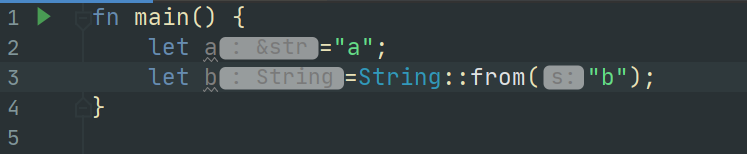

### Rust中的所有权系统(Ownership)

目前大部分的编程语言管理内存都是使用的：1.自动管理(垃圾回收机制，像Java) 2.手动编码控制内存的分配(像C或C++)
然而Rust不一样，另辟蹊径，靠的是编译器来保证内存的分配和回收。也叫做`Ownership`,这一概念是在Rust中独有的，是Rust独有的特性之一。如何看待这一特性，就是仁者见仁智者见智了，对于一个Java程序员来说，这一特性彷佛没有那么好，反而有点让人接受不了(可能是因为Rust是一门系统级别的编程语言，比较注重性能和安全性)

>memory is managed through a system of ownership with a set of rules that the compiler checks at compile time. None of the ownership features slow down your program while it’s running.

要明白所有权系统，要先对**堆栈**有基本的认识。

>All data stored on the stack must have a known, fixed size. Data with an unknown size at compile time or a size that might change must be stored on the heap instead

这个点不知道，记录一下

>When your code calls a function, the values passed into the function (including, potentially, pointers to data on the heap) and the function’s local variables get pushed onto the stack. When the function is over, those values get popped off the stack.

函数中的局部变量是分配在栈上的，每当函数调用完成，变量也已经被弹出栈顶了。

官方文档也总结的很到位

>Keeping track of what parts of code are using what data on the heap, minimizing the amount of duplicate data on the heap, and cleaning up unused data on the heap so you don’t run out of space are all problems that ownership addresses. Once you understand ownership, you won’t need to think about the stack and the heap very often, but knowing that managing heap data is why ownership exists can help explain why it works the way it does.

所有权系统主要是为了帮助你更好的管理变量在堆栈上的分配。系统级别的编程语言比较在变量是分配到堆还是栈上，对于使用Java的我来说，对与这个概念是相当模糊的，只是大概知道Java中的对象大部分都是分配到堆上的，而且GC也是针对堆上的对象进行的回收。
为此顺便学习一下Java方面的知识吧。

JVM规范让每个Java线程拥有自己的独立的JVM栈，也就是Java方法的调用栈。

JVM里的“堆”（heap）特指用于存放Java对象的内存区域。所以根据这个定义，Java对象全部都在堆上

要注意，这个“堆”并不是数据结构意义上的堆（Heap (data structure)，一种有序的树），而是动态内存分配意义上的堆——用于管理动态生命周期的内存区域。

JVM的堆被同一个JVM实例中的所有Java线程共享。它通常由某种自动内存管理机制所管理，这种机制通常叫做“垃圾回收”（garbage collection，GC）。JVM规范并不强制要求JVM实现采用哪种GC算法。

好了，回到Rust中的所有权系统。

所有权系统需要熟知一下三条规则：

 - Each value in Rust has a variable that’s called its owner(每一变量都有其拥有者//不知道这样翻译对不对 - -).
 - There can only be one owner at a time.(同一时刻一个变量只能有一个拥有者)
 - When the owner goes out of scope, the value will be dropped.(当拥有者不在作用域中了，那么这个值就会被释放掉)

规则比我想象的要简单明了许多，看上去很简洁，实际上却饱含了很多信息量。。。

其中提到了*scope*(作用域)这个概念，有点类似于Spring中的scope的样子或者http中的session作用域和request作用域。

官方给的例子还是很容易理解的
```rust
fn main() {
    {                      // s is not valid here, it’s not yet declared
        let s = "hello";   // s is valid from this point forward

        // do stuff with s
    }                      // this scope is now over, and s is no longer valid
}
```

有一点特殊的是`String`和`literal`

在IDEA的提示下发现这是两种不同的类型，然儿在Java中都是统一的**String**



原因是因为`literal`是固定长度的不可变的，分配在栈上的数据结构。而`String`是跟Java中的String类型一样是可变的。

同为String类型但是有点不同的是。

Java中的String可以这样写
```java
class Scratch {
    public static void main(String[] args) {
        String a = "a";
        String b = a;
        a += "zxc";
        System.out.println(a + " " + b);
    }
}
```
然而在Rust中这却不能这样

```rust
fn main() {
    let s1 = String::from("hello");
    // let s2 = s1; 编译不通过

    println!("{}, world!", s1);
}
```

原因是因为Rust中是`s2`并没有对`s1`进行值拷贝，传递的是`s1`的指针。根据官方的解释，这里涉及到了 **浅拷贝**和**深拷贝**

>If you’ve heard the terms shallow copy and deep copy while working with other languages, the concept of copying the pointer, length, and capacity without copying the data probably sounds like making a shallow copy. But because Rust also invalidates the first variable, instead of being called a shallow copy, it’s known as a move. In this example, we would say that s1 was moved into s2.  

Rust并没有隐式的进行**浅拷贝**操作。而是让`s1`失效，这样的操作叫做 `moved`,相当于把`s1`上的值的指针移动到了`s2`上这样 `s1`就失效了。
为什么要这样做可能是为了能够更好的追踪内存并回收吧。

如果要使用`深拷贝`,就要使用`clone`方法。该方法会对堆和栈上的所有内容进行拷贝。

```rust
fn main() {
    let s1 = String::from("hello");
    let s2 = s1.clone();

    println!("s1 = {}, s2 = {}", s1, s2);
}
```

在有些地方，跟Java类似，对于基本的数据类型，都不需要使用显示的使用`clone`方法

```rust
fn main() {
    let x = 5;
    let y = x;

    println!("x = {}, y = {}", x, y);
}
```

在Rust中所有都遵循所有权系统的规则

在函数中，传递进去的参数也是所有权移交的一种方式
```rust
fn main() {
    let s = String::from("hello");  // s comes into scope

    takes_ownership(s);             // s's value moves into the function...
                                    // ... and so is no longer valid here

    let x = 5;                      // x comes into scope

    makes_copy(x);                  // x would move into the function,
                                    // but i32 is Copy, so it’s okay to still
                                    // use x afterward

} // Here, x goes out of scope, then s. But because s's value was moved, nothing
  // special happens.

fn takes_ownership(some_string: String) { // some_string comes into scope
    println!("{}", some_string);
} // Here, some_string goes out of scope and `drop` is called. The backing
  // memory is freed.

fn makes_copy(some_integer: i32) { // some_integer comes into scope
    println!("{}", some_integer);
} // Here, some_integer goes out of scope. Nothing special happens.
```

返回值中就更好理解了

```rust
fn main() {
    let s1 = gives_ownership();         // gives_ownership moves its return
                                        // value into s1

    let s2 = String::from("hello");     // s2 comes into scope

    let s3 = takes_and_gives_back(s2);  // s2 is moved into
                                        // takes_and_gives_back, which also
                                        // moves its return value into s3
} // Here, s3 goes out of scope and is dropped. s2 goes out of scope but was
  // moved, so nothing happens. s1 goes out of scope and is dropped.

fn gives_ownership() -> String {             // gives_ownership will move its
                                             // return value into the function
                                             // that calls it

    let some_string = String::from("hello"); // some_string comes into scope

    some_string                              // some_string is returned and
                                             // moves out to the calling
                                             // function
}

// takes_and_gives_back will take a String and return one
fn takes_and_gives_back(a_string: String) -> String { // a_string comes into
                                                      // scope

    a_string  // a_string is returned and moves out to the calling function
}
```

所有权系统就像是给每一个变量进行了一个轨迹追踪一样。这样的话写代码感觉会更加清晰明了，但是阅读起来可能有点难受吧？

总体来说还是不错的设计。

完！

### 参考
[Java虚拟机的堆、栈、堆栈如何去理解？ RednaxelaFX大佬解答](https://www.zhihu.com/question/29833675)