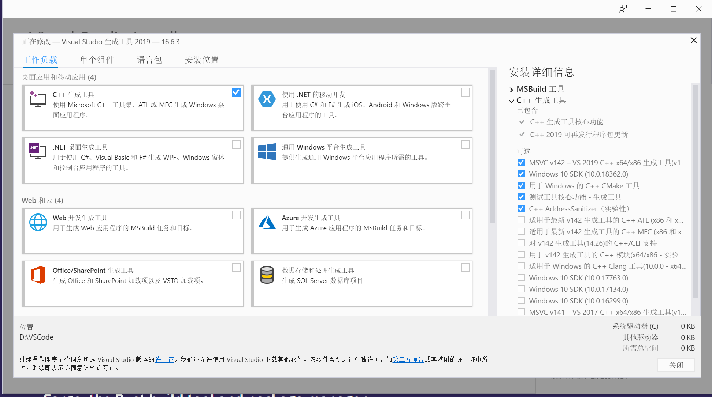
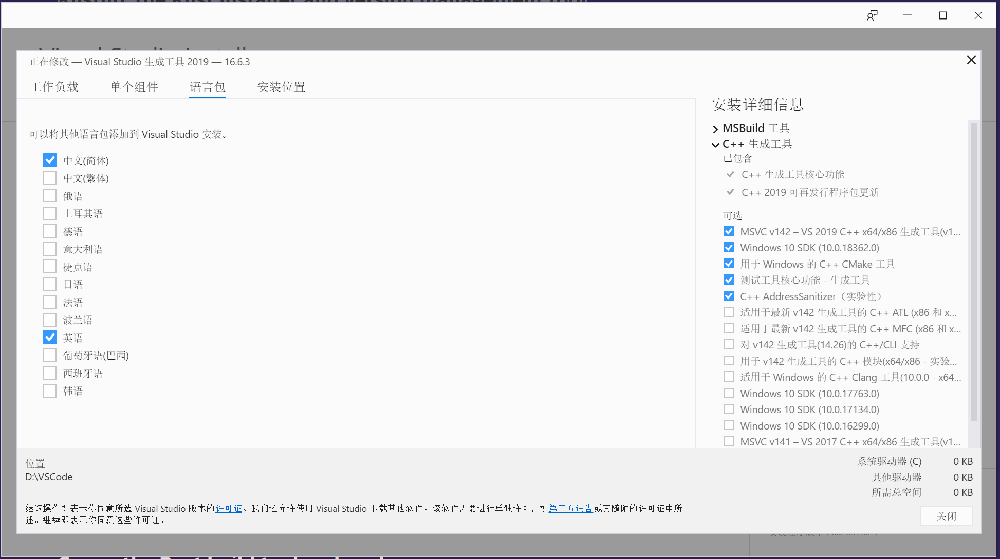

### 安装Rust

直接到[Rust官方网站](https://www.rust-lang.org/) 找到适合自己系统的安装包exe文件下载进行安装就行了

官方提供win32位和64位的安装版本，不过一般都是64位的。还提供了WSL的安装版本。

如果安装rust很慢，使用镜像：
>$ENV:RUSTUP_DIST_SERVER=‘https://mirrors.ustc.edu.cn/rust-static‘
 
>$ENV:RUSTUP_UPDATE_ROOT=‘https://mirrors.ustc.edu.cn/rust-static/rustup‘

然后到微软的官网下载 找到[Visual Studio 2019 工具](https://visualstudio.microsoft.com/zh-hans/downloads/)
下载好之后就可以进行安装了。

勾选基本的C++构建环境

**再选择语言包**

最后配置IDE插件，本人使用的是IDEA(也可以用Clion)作为IDE。直接到官网找到Rust对应的插件[RUST-FOR-IDEA](https://github.com/intellij-rust/intellij-rust)

(**移动网真是太垃圾了，慢的要死**) 

安装完之后重启IDEA，创建项目的时候就能看到Rust项目的选项了。

然后配置一下源(类似Maven的阿里源一样) [清华源](https://mirrors.tuna.tsinghua.edu.cn/help/crates.io-index.git/)

完！
